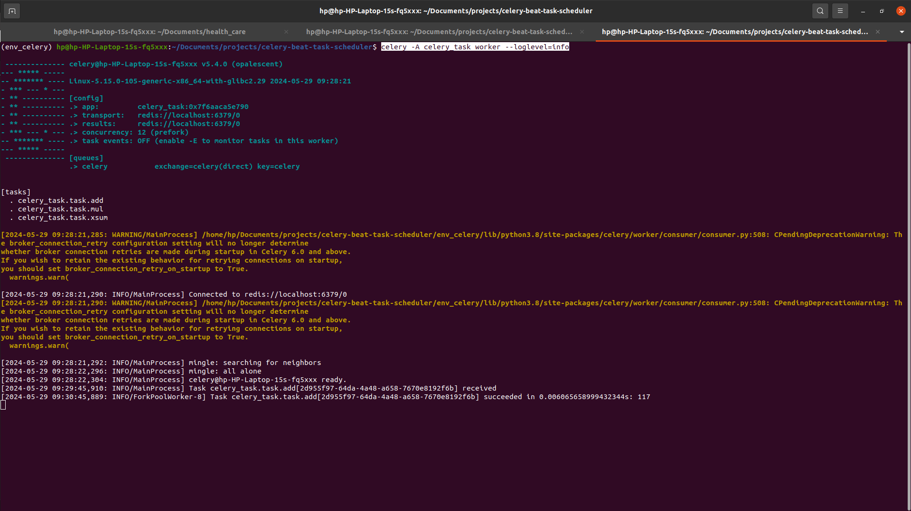

# commands for start the celery worker

celery -A celery_task worker --loglevel=info

# run the url on browser

http://localhost:8000/add/

http://localhost:8000/task_status/<task_id>/   # task_id is given by 1st api in response

# Response

Task received by celery :- Task celery_task.task.add["task_id"] received

Task executed by celery :- Task celery_task.task.add["task_id"] succeeded in 0.006065658999432344s: 117

See response image :- 

# commands for registering the peroidic tasks

python manage.py create_periodic_task (run this command before running celery beat)

# commands for start the celery beat

celery -A celery_task beat --loglevel=info

Terminal Image :- 